# BemNaHora

**Davi Augusto Dias Soares**

**Lucas Giovine Madureira Falcone**

**Luisa Clara de Paula Lara Silva**

**Pedro Henrique Morais Marques**

---

Professores:

**Prof. Artur Martins Mol**

**Prof. Leonardo Vilela Cardoso**

---

_Curso de Engenharia de Software, Campus Coração Eucarístico

_Instituto de Informática e Ciências Exatas – Pontifícia Universidade de Minas Gerais (PUC MINAS), Belo Horizonte – MG – Brasil_

---

**Resumo**. 

O Bem na Hora é um aplicativo voltado para agilizar e facilitar o delivery de bebidas e carnes, conectando de forma prática clientes, distribuidoras e entregadores. Seu objetivo é oferecer conveniência ao consumidor, permitindo que ele encontre e receba produtos de qualidade no menor tempo possível, com acompanhamento do pedido. Além disso, o app busca beneficiar restaurantes e fornecedores, ampliando sua visibilidade e alcance, enquanto proporciona aos entregadores uma oportunidade de trabalho ágil e organizado, com rotas e entregas otimizadas. Assim, o Bem na Hora atua como um ecossistema que integra todos os envolvidos no processo de delivery, priorizando rapidez, eficiência e praticidade.

---

## Histórico de Revisões

| **Data** | **Autor** | **Descrição** | **Versão** |
| --- | --- | --- | --- |
| **09/092025** | Luisa Clara | Edição da seção 3 | [1.0] |
| **09/092025** | Pedro | Edição da seção 2 | [1.1] |
| **09/092025** | Lucas e Davi | Edição da seção 1 | [1.2] |
| | | | |
| | | | |

## SUMÁRIO

1. [Apresentação](#apresentacao "Apresentação")  
	1.1. Problema  
	1.2. Objetivos do trabalho  
	1.3. Definições e Abreviaturas  
 
2. [Nosso Produto](#produto "Nosso Produto")  
	2.1. Visão do Produto  
   	2.2. Nosso Produto  
   	2.3. Personas  

3. [Requisitos](#requisitos "Requisitos")  
	3.1. Requisitos Funcionais  
	3.2. Requisitos Não-Funcionais  
	3.3. Restrições Arquiteturais  
	3.4. Mecanismos Arquiteturais  

4. [Modelagem](#modelagem "Modelagem e projeto arquitetural")  
	4.1. Visão de Negócio  
	4.2. Visão Lógica  
	4.3. Modelo de dados (opcional)  

5. [Wireframes](#wireframes "Wireframes")  

6. [Solução](#solucao "Projeto da Solução")  

7. [Avaliação](#avaliacao "Avaliação da Arquitetura")  
	7.1. Cenários  
	7.2. Avaliação  

8. [Referências](#referencias "REFERÊNCIAS") 

9. [Apêndices](#apendices "APÊNDICES") 
	9.1 Ferramentas  

# 1. Apresentação

O Bem na Hora é um aplicativo voltado para agilizar e facilitar o delivery de bebidas e carnes, conectando de forma prática clientes, distribuidoras e entregadores. Seu objetivo é oferecer conveniência ao consumidor, permitindo que ele encontre e receba produtos de qualidade no menor tempo possível, com acompanhamento do pedido.

## 1.1. Problema

Distribuidoras não possuem um app específico para elas

## 1.2. Objetivos do trabalho

Nosso  objetivo é oferecer conveniência ao consumidor, permitindo que ele encontre e receba produtos de qualidade no menor tempo possível, com acompanhamento do pedido. Além disso, o app busca beneficiar restaurantes e fornecedores, ampliando sua visibilidade e alcance, enquanto proporciona aos entregadores uma oportunidade de trabalho ágil e organizado, com rotas e entregas otimizadas. Assim, o Bem na Hora atua como um ecossistema que integra todos os envolvidos no processo de delivery, priorizando rapidez, eficiência e praticidade.

## 1.3. Definições e Abreviaturas

| Sigla/Termo     | Definição                                                                 |
|-----------------|---------------------------------------------------------------------------|
| App             | Aplicativo móvel, software instalado em smartphones ou tablets.            |
| API             | Interface de Programação de Aplicações, usada para integração de sistemas. |
| UX              | User Experience, experiência do usuário ao interagir com o sistema.        |
| UI              | User Interface, interface gráfica apresentada ao usuário.                  |
| Cliente         | Usuário final que realiza pedidos pelo aplicativo.                         |
| Distribuidora   | Empresa/parceiro responsável pelo fornecimento dos produtos.               |
| Entregador      | Profissional responsável pela entrega dos pedidos ao cliente.              |
| Pedido          | Solicitação de compra feita pelo cliente no app.                           |
| Delivery        | Serviço de entrega de produtos ao cliente.                                 |
| Backend         | Parte do sistema responsável pelo processamento e regras de negócio.        |
| Frontend        | Parte do sistema responsável pela interface com o usuário.                 |
| Dashboard       | Painel de controle para acompanhamento de pedidos e operações.             |
| Geolocalização  | Recurso para identificar a localização do usuário ou entregador.           |
| Notificação Push| Mensagem enviada pelo app para alertar o usuário em tempo real.            |

# 2. Nosso Produto

_Esta seção explora um pouco mais o produto a ser desenvolvido_

## 2.1 Visão do Produto
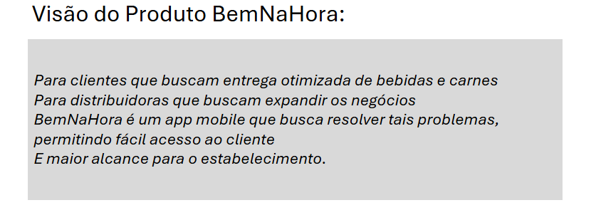

## 2.2 Nosso Produto
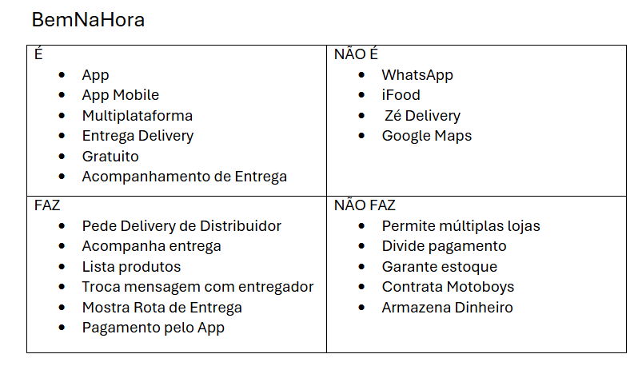

## 2.3 Personas
<h2>Persona 1</h2>
<table>
  <tr>
    <td style="vertical-align: top; width: 150px;">
      
    </td>
    <td style="vertical-align: top; padding-left: 10px;">
      <strong>Nome:</strong> Andre Gustavo  
      <strong>Idade:</strong> 32 anos  
      <strong>Hobby:</strong> Ver futebol  
      <strong>Trabalho:</strong> Dono de distribuidora  
      <strong>Personalidade:</strong> Extrovertido, competitivo  
      <strong>Sonho:</strong> Comprar uma casa no interior para ficar quando se aposentar  
      <strong>Dores:</strong> Aumentar as vendas com a geração mais nova  
    </td>
  </tr>
</table>

<h2>Persona 2</h2>
<table>
  <tr>
    <td style="vertical-align: top; width: 150px;">
      
    </td>
    <td style="vertical-align: top; padding-left: 10px;">
      <strong>Nome:</strong> Barbara Oliveira  
      <strong>Idade:</strong> 25 anos  
      <strong>Hobby:</strong> Escutar música  
      <strong>Trabalho:</strong> Assistente de escritorio  
      <strong>Personalidade:</strong> Educada, criativa, animada   
      <strong>Sonho:</strong> Ir no show da Taylor Swift  
      <strong>Dores:</strong> Ter que ir pessoalmente em sua distribuidora preferida para pedir uma bebida  
    </td>
  </tr>
</table>

# 3. Requisitos

Esta seção descreve os requisitos contemplados nesta descrição arquitetural, divididos em dois grupos: funcionais e não funcionais.

## 3.1. Requisitos Funcionais

| **ID** | **Descrição** | **Prioridade** | **Plataforma** | **Sprint** | **Status** |
| --- | --- | --- | --- | --- | --- |
| RF001 | CRUD Usuário |  ALTA| _web e mobile_ | Sprint 1 | ❌ |
| RF002 | Autenticação do Usuário | ALTA | _ web e mobile_ |  | ❌ |
| RF003 | Visualização de Dashboard |ALTA | _web e mobile_ |  | ❌ |
| RF004 | CRUD Entregadores/Motoqueiros | MÉDIA | _web e mobile_ |  | ❌ |
| RF005 | CRUD Entregas | MÉDIA | _web e mobile_ | | ❌ |
| RF006 | Visualização da Entrega | ALTA | _web e mobile_ |   | ❌ |
| RF007 | Troca de Mensagens Entre Cliente e Entregador | MÉDIA | _web e mobile_ |   | ❌ |
| RF008 | Notificações da Entrega | MÉDIA | _web e mobile_ |   | ❌ |
| RF009 |  Recuperar Senha| BAIXA | _web e mobile_ |   |❌  |
| RF010 |  Pagamento Pelo Aplicativo| ALTA | _web e mobile_ |   | ❌ |
| RF011 | Filtro de Itens | MÉDIA | _web e mobile_ |   | ❌ |
| RF012 | Review de Entrega | BAIXA | _web e mobile_ |   | ❌ |
| RF013 | CRUD Produtos | ALTA| _web e mobile_ |   | ❌ |

## 3.2. Requisitos Não-Funcionais

| **ID** | **Descrição** |
| --- | --- |
| RNF001 | Dados sensíveis devem ser protegidos por criptografia e autenticação segura. |
| RNF002 | O sistema deve suportar aumento no número de usuários e entregas sem perda de desempenho. |

## 3.3. Restrições Arquiteturais

As restrições impostas ao projeto que afetam sua arquitetura são:

- O software deverá ser desenvolvido em Flutter/.net c#;
- O banco de dados será feito em NoSql MongoDb
- A comunicação da API deve seguir o padrão RESTful.
- Será utilizado a API externa do MercadoPago para realizar pagamentos

## 3.4. Mecanismos Arquiteturais

| **Análise** | **Design** | **Implementação** |
| --- | --- | --- |
| Persistência | Banco de Dados NoSQL orientado a documentos | MongoDB  |
| Front end | Framework reativo e multiplataforma | Flutter Framework  |
| Back end | Desenvolvimento de uma API RESTful customizada |  ASP.NET (usando C#)|
| Integração | Consumo de APIs RESTful de terceiros para funcionalidades específicas | Integração com a API do Mercado Pago  |
| Log do sistema | Armazenamento de logs em formato de documento (JSON/BSON) em uma coleção dedicada dentro do banco de dados principal da aplicação |  MongoDB|
| Teste de Software | Estratégia de testes multi-nível, cobrindo testes unitários | xUnit ou NUnit (Backend .NET), flutter_test e integration_test (Frontend Flutter). |
| Deploy | O código-fonte do backend é implantado a partir de um repositório Git e os pacotes do app móvel são gerados localmente |  Backend: Git para controle de versão e deploy manual em um servidor de aplicação (ex: IIS).   Frontend: Geração manual de pacotes de instalação (APK para Android, IPA para iOS).|

# 4. Modelagem e Projeto Arquitetural

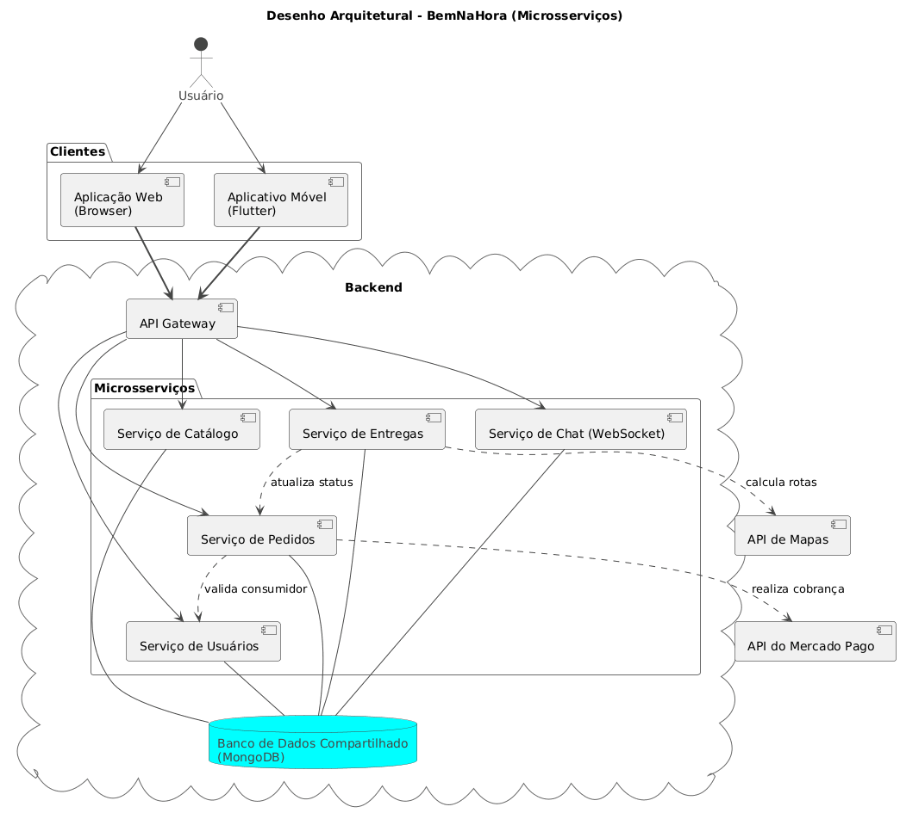

**Figura 1 - Visão Geral da Solução**

A arquitetura do sistema BemNaHora é composta por um backend modular que atende tanto a aplicação web (acessada via navegador) quanto o aplicativo móvel (desenvolvido em Flutter), por meio de um API Gateway central que gerencia as requisições dos clientes.

O backend é formado por diversos módulos responsáveis por funcionalidades específicas:

- Catálogo: gerencia os itens e serviços disponíveis na plataforma.

- Pedidos: processa e valida pedidos, interagindo com os módulos de usuários e entregas.

- Usuários: gerencia o cadastro e a autenticação dos consumidores.

- Entregas: controla o status e o andamento das entregas.

- Chat (WebSocket): oferece comunicação em tempo real entre usuários e entregadores.

Todos os módulos compartilham um banco de dados MongoDB centralizado.
O sistema também realiza integrações externas com:

- API de Mapas, utilizada para o cálculo de rotas.

- API do Mercado Pago, responsável pelo processamento de pagamentos.

## 4.1. Visão de Negócio (Funcionalidades)

1. O sistema deve permitir o cadastro e gerenciamento de perfis para três tipos de usuários: Consumidores, Distribuidoras e Entregadores.
2. O sistema deve permitir que as Distribuidoras cadastrem e gerenciem seu catálogo de produtos, incluindo nome, descrição, preço e estoque.
3. O sistema deve oferecer uma funcionalidade de carrinho de compras, permitindo que o Consumidor adicione, remova e visualize itens antes de finalizar a compra.
4. O sistema deve permitir que o Consumidor converta o conteúdo do seu carrinho em um Pedido formal.
5. O sistema deve processar pagamentos online de forma segura, integrando-se com a API do Mercado Pago para realizar a cobrança no cartão de crédito do cliente.
6. O sistema deve fornecer rastreamento da entrega, permitindo que o Consumidor visualize a localização do Entregador em um mapa.
7. O sistema deve exibir a localização do Consumidor para o Entregador no momento da entrega para facilitar a finalização do percurso.
8. O sistema deve disponibilizar um chat em tempo real para permitir a comunicação entre os usuários (Consumidor, Distribuidora e Entregador) no contexto de um pedido específico.
9. O sistema deve enviar notificações push ao Consumidor sobre atualizações importantes no status do pedido (ex: "Saiu para entrega", "Entregue").
10. O sistema deve oferecer um painel de controle (dashboard) para as Distribuidoras, exibindo métricas de vendas e desempenho.

### Histórias de Usuário

|EU COMO... `PERSONA`| QUERO/PRECISO ... `FUNCIONALIDADE` |PARA ... `MOTIVO/VALOR`                 |
|--------------------|------------------------------------|----------------------------------------|
|Consumidor  | Registrar adicionar itens no meu carrinho           | Não esquecer o que gostaria de comprar  |
|Distribuidora       | Cadastrar produtos                 | os consumidores saibam quais produtos possuo |
|Entregador      |  Ver um mapa que indica onde é a entrega| Para poder me localizar melhor|
|Consumidor | Receber notificação do meu pedido | Acompanhar o status do pedido de modo mais facil | 
|Distribuidora | ver metricas de vendas | para acompanhar quais produtos vendo mais |
|Usuário | Trocar mensagens com outros usuários | facilitar a conversação na entrega e com o estabelicimento |
|Consumidor | fazer a compra online | facilitar na cobrança |

## 4.2. Visão Lógica

### Diagrama de Classes

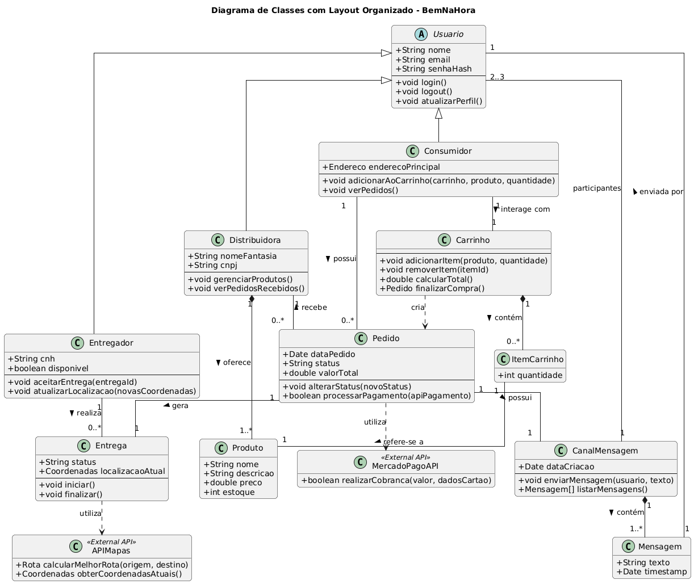

**Figura 2 – Diagrama de classes**

Consumidor, entregador e distribuidora herdam as características de usuário.
A distribuidora cadastra produtos, que podem ser inseridos no carrinho por um consumidor. O carrinho gera um pedido, e cada pedido pode ser rastreado pelo consumidor, com base na localização do entregador.

### Diagrama de componentes

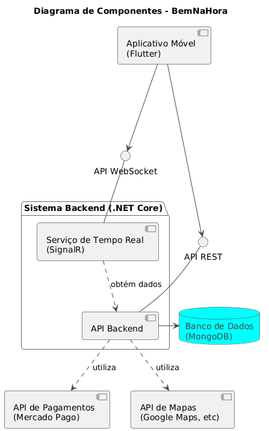

**Figura 3 – Diagrama de Componentes**

- ### **Aplicativo Móvel (Flutter)**

O Aplicativo Móvel é a interface visual com a qual o usuário interage. Ele é responsável por exibir todas as telas, capturar as ações do usuário (como cliques e digitação) e se comunicar com o Backend para buscar dados, como produtos e status de pedidos, ou para receber atualizações instantâneas, como mensagens de chat e a localização do entregador.

- ### **API Backend**

A API Backend é o cérebro central da aplicação, executando toda a lógica de negócio principal. É ela quem valida usuários, processa a criação de pedidos, gerencia o acesso ao banco de dados e orquestra a comunicação com serviços externos, como os sistemas de pagamento e de mapas, garantindo a integridade e a segurança de todas as operações.

- ### **Serviço de Tempo Real (SignalR)**

Este serviço é o especialista em comunicação instantânea, mantendo uma conexão contínua com o aplicativo móvel através de WebSockets. Sua função é "empurrar" dados para o usuário em tempo real, o que permite funcionalidades como o chat, onde as mensagens aparecem instantaneamente.

- ### **Banco de Dados (MongoDB)**

O Banco de Dados funciona como a memória permanente e centralizada do sistema. Sua única responsabilidade é armazenar e recuperar de forma segura e eficiente todas as informações da aplicação, como perfis de usuários, catálogos de produtos e históricos de pedidos, atendendo exclusivamente às solicitações da API Backend.

- ### **API de Pagamentos (Mercado Pago)**

Como um componente externo, a API de Pagamentos é responsável por processar as transações financeiras de forma segura. O Backend delega a ela a tarefa de receber os dados da compra, comunicar-se com os bancos para autorizar o pagamento e retornar uma confirmação de sucesso ou falha na transação.

- ### **API de Mapas (Google Maps, etc.)**

Esta API externa é o serviço especializado em geolocalização. O Backend a utiliza para obter funcionalidades complexas como o cálculo da rota mais eficiente para uma entrega, a conversão de endereços em coordenadas e o fornecimento dos dados visuais para a renderização do mapa no aplicativo.

# 5. Wireframes

> Wireframes são protótipos das telas da aplicação usados em design de interface para sugerir a
> estrutura de um site web e seu relacionamentos entre suas
> páginas. Um wireframe web é uma ilustração semelhante ao
> layout de elementos fundamentais na interface.
> 
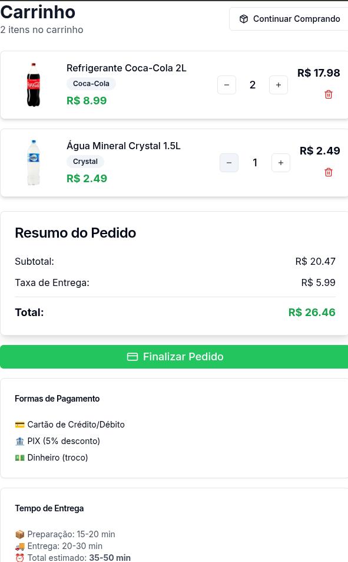
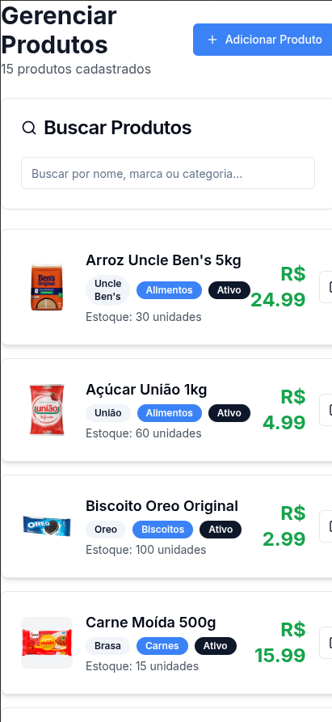
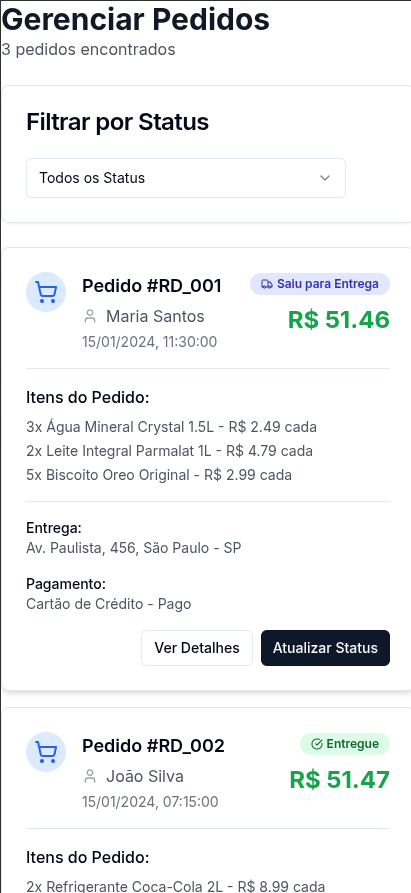
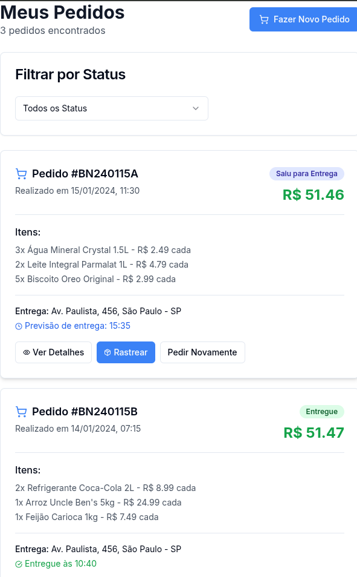
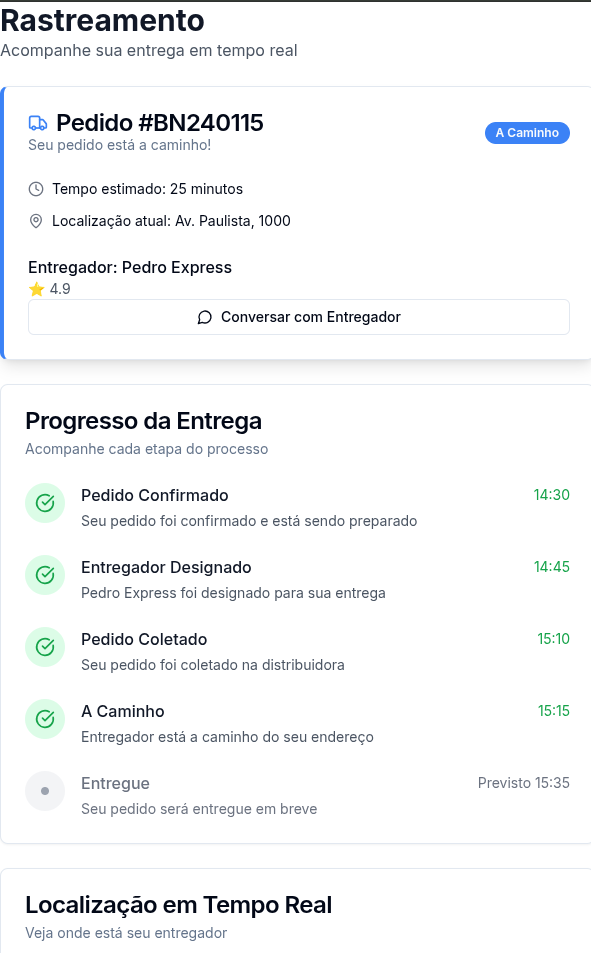

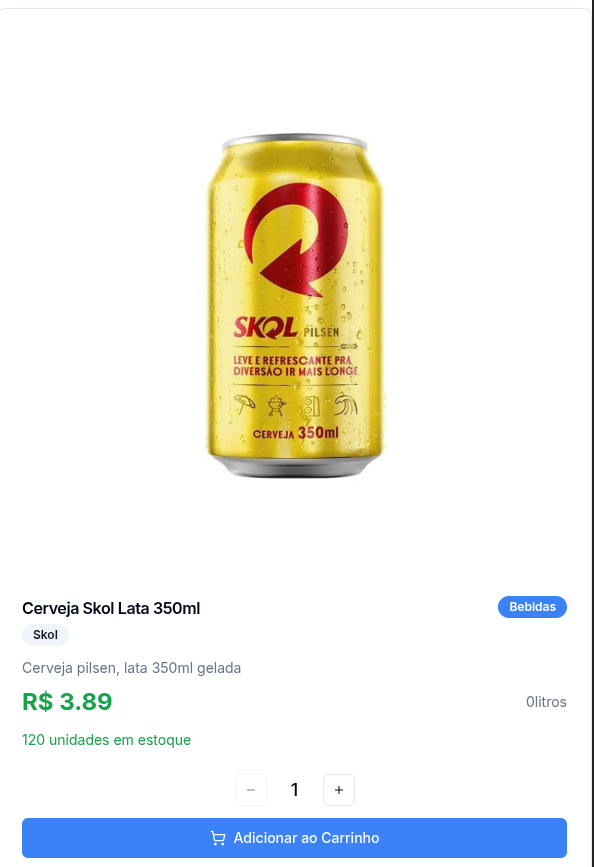
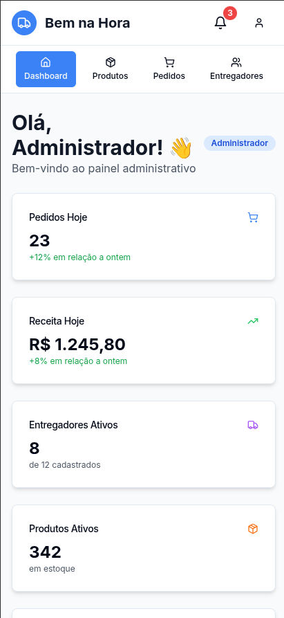
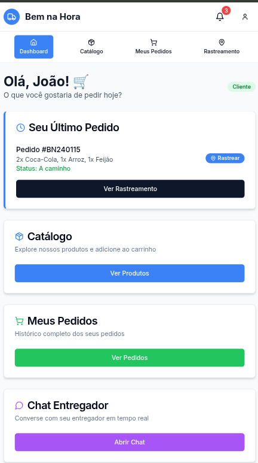

# 6. Projeto da Solução

_Apresente as telas dos sistema construído com uma descrição sucinta de cada uma das interfaces._

# 7. Avaliação da Arquitetura

_Esta seção descreve a avaliação da arquitetura apresentada, baseada no método ATAM._

## 7.1. Cenários

_Apresente os cenários de testes utilizados na realização dos testes da sua aplicação. Escolha cenários de testes que demonstrem os requisitos não funcionais sendo satisfeitos. Os requisitos a seguir são apenas exemplos de possíveis requisitos, devendo ser revistos, adequados a cada projeto e complementados de forma a terem uma especificação completa e auto-explicativa._

**Cenário 1 - Acessibilidade:** Suspendisse consequat consectetur velit. Sed sem risus, dictum dictum facilisis vitae, commodo quis leo. Vivamus nulla sem, cursus a mollis quis, interdum at nulla. Nullam dictum congue mauris. Praesent nec nisi hendrerit, ullamcorper tortor non, rutrum sem. In non lectus tortor. Nulla vel tincidunt eros.

**Cenário 2 - Interoperabilidade:** Pellentesque habitant morbi tristique senectus et netus et malesuada fames ac turpis egestas. Fusce ut accumsan erat. Pellentesque in enim tempus, iaculis sem in, semper arcu.

**Cenário 3 - Manutenibilidade:** Phasellus magna tellus, consectetur quis scelerisque eget, ultricies eu ligula. Sed rhoncus fermentum nisi, a ullamcorper leo fringilla id. Nulla lacinia sem vel magna ornare, non tincidunt ipsum rhoncus. Nam euismod semper ante id tristique. Mauris vel elit augue.

**Cenário 4 - Segurança:** Suspendisse consectetur porta tortor non convallis. Sed lobortis erat sed dignissim dignissim. Nunc eleifend elit et aliquet imperdiet. Ut eu quam at lacus tincidunt fringilla eget maximus metus. Praesent finibus, sapien eget molestie porta, neque turpis congue risus, vel porttitor sapien tortor ac nulla. Aliquam erat volutpat.

## 7.2. Avaliação

_Apresente as medidas registradas na coleta de dados. O que não for possível quantificar apresente uma justificativa baseada em evidências qualitativas que suportam o atendimento do requisito não-funcional. Apresente uma avaliação geral da arquitetura indicando os pontos fortes e as limitações da arquitetura proposta._

| **Atributo de Qualidade:** | Segurança |
| --- | --- |
| **Requisito de Qualidade** | Acesso aos recursos restritos deve ser controlado |
| **Preocupação:** | Os acessos de usuários devem ser controlados de forma que cada um tenha acesso apenas aos recursos condizentes as suas credenciais. |
| **Cenários(s):** | Cenário 4 |
| **Ambiente:** | Sistema em operação normal |
| **Estímulo:** | Acesso do administrador do sistema as funcionalidades de cadastro de novos produtos e exclusão de produtos. |
| **Mecanismo:** | O servidor de aplicação (Rails) gera um _token_ de acesso para o usuário que se autentica no sistema. Este _token_ é transferido para a camada de visualização (Angular) após a autenticação e o tratamento visual das funcionalidades podem ser tratados neste nível. |
| **Medida de Resposta:** | As áreas restritas do sistema devem ser disponibilizadas apenas quando há o acesso de usuários credenciados. |

**Considerações sobre a arquitetura:**

| **Riscos:** | Não existe |
| --- | --- |
| **Pontos de Sensibilidade:** | Não existe |
| _ **Tradeoff** _ **:** | Não existe |

Evidências dos testes realizados

_Apresente imagens, descreva os testes de tal forma que se comprove a realização da avaliação._

# 8. REFERÊNCIAS

_Como um projeto da arquitetura de uma aplicação não requer revisão bibliográfica, a inclusão das referências não é obrigatória. No entanto, caso você deseje incluir referências relacionadas às tecnologias, padrões, ou metodologias que serão usadas no seu trabalho, relacione-as de acordo com a ABNT._

Verifique no link abaixo como devem ser as referências no padrão ABNT:

http://www.pucminas.br/imagedb/documento/DOC\_DSC\_NOME\_ARQUI20160217102425.pdf

**[1]** - _ELMASRI, Ramez; NAVATHE, Sham. **Sistemas de banco de dados**. 7. ed. São Paulo: Pearson, c2019. E-book. ISBN 9788543025001._

**[2]** - _COPPIN, Ben. **Inteligência artificial**. Rio de Janeiro, RJ: LTC, c2010. E-book. ISBN 978-85-216-2936-8._

**[3]** - _CORMEN, Thomas H. et al. **Algoritmos: teoria e prática**. Rio de Janeiro, RJ: Elsevier, Campus, c2012. xvi, 926 p. ISBN 9788535236996._

**[4]** - _SUTHERLAND, Jeffrey Victor. **Scrum: a arte de fazer o dobro do trabalho na metade do tempo**. 2. ed. rev. São Paulo, SP: Leya, 2016. 236, [4] p. ISBN 9788544104514._

**[5]** - _RUSSELL, Stuart J.; NORVIG, Peter. **Inteligência artificial**. Rio de Janeiro: Elsevier, c2013. xxi, 988 p. ISBN 9788535237016._

# 9. APÊNDICES

_Inclua o URL do repositório (Github, Bitbucket, etc) onde você armazenou o código da sua prova de conceito/protótipo arquitetural da aplicação como anexos. A inclusão da URL desse repositório de código servirá como base para garantir a autenticidade dos trabalhos._

## 9.1 Ferramentas

| Ambiente  | Plataforma              |Link de Acesso |
|-----------|-------------------------|---------------|
|Repositório de código | GitHub | https://github.com/XXXXXXX | 
|Hospedagem do site | Heroku |  https://XXXXXXX.herokuapp.com | 
|Protótipo Interativo | MavelApp ou Figma | https://figma.com/XXXXXXX |
|Documentação de teste | Github | https://githun.com/xxxx |
